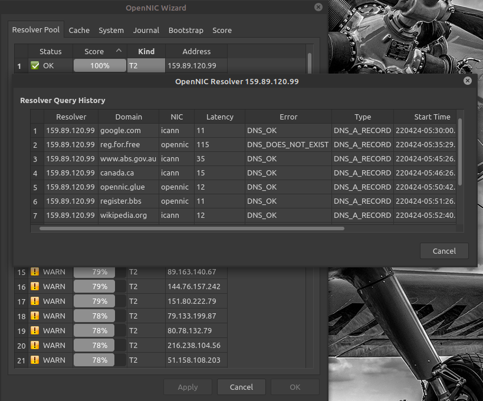
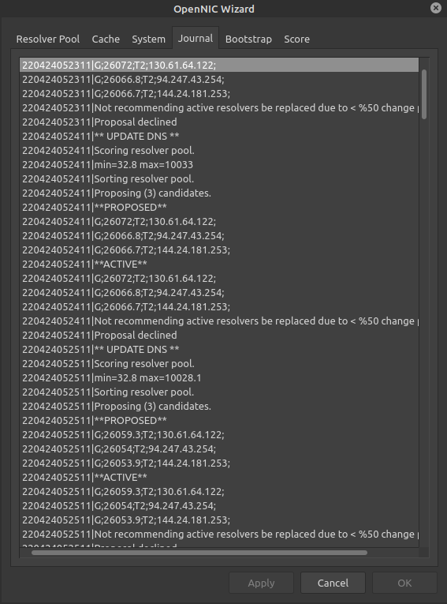
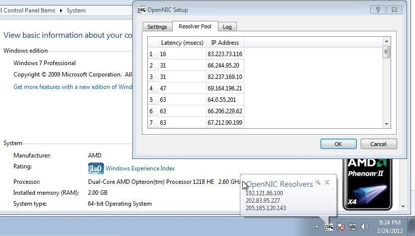
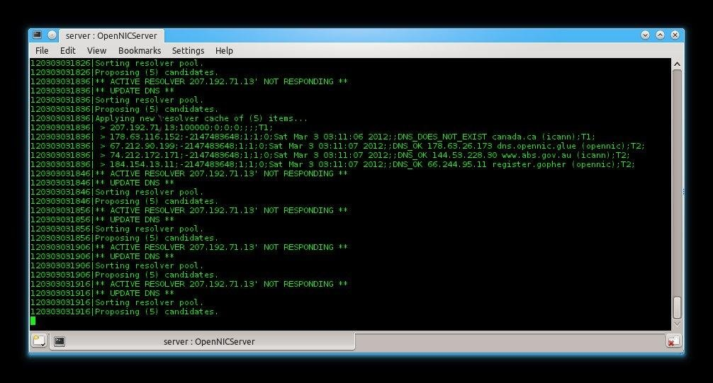

# About The OpenNIC Project

["The OpenNIC Project"](http://www.opennicproject.org) is an organization of dedicated volunteers who run an alternative [DNS](https://en.wikipedia.org/wiki/Domain_Name_System) network. OpenNIC is owned and operated by the OpenNIC community. 

Membership is open to all who share an interest in keeping DNS free for all users. 

The goal of The OpenNIC Project is to provide you with quick and reliable DNS services and access
to domains not administered by [ICANN](https://www.icann.org/).

OpenNIC provides resolution to all ICANN domains as well as OpenNIC's own [TLD](https://en.wikipedia.org/wiki/Top-level_domain)s:

.bbs
.chan
.cyb
.dyn
.geek
.gopher
.indy
.libre
.neo
.null
.o
.oss
.oz
.parody
.pirate


# OpenNIC Wizard Features
  - OpenNIC Wizard service continually seeks DNS resolvers with best performance.
  - No-pain approach to setting up your PC to work with The OpenNIC Project
  - OpenNIC Wizard Task tray applet for observing and optionally tweeking the configuration
  - To start using The OpenNIC Project today, use OpenNIC Wizard. 
  - Simply run the installer and you're instantly using OpenNIC resolvers.

# Method of Operation Overview

The OpenNIC Wizard is divided into ttwo parts, OpenNICServer and OpenNIC

## OpenNICServer

The bootstrap.t1 file is a list of IP addresses which OpenNICServer uses to locate the T1 (root) resolvers. 

Onces the T1 resolvers have been confirmed, they are quried in such a way as to walk the tree of [T2](https://servers.opennic.org/?tier=2) resolvers and buuild a table of the T2 resolvers.

Once a resolver tree has been constructed, then, periodically a resolver is chosen at random, 
and is tested for performance, given a random TLD from the bootstrap.domains, file, the resolver success, and round-trip time are both captures, and retained as a record of that resolver's performance.

As resolvers are tested this way, the higher performing resolvers float to the top of the list.

Once therre is sufficient change in the top pwerformers, then the resolver pool currrently being used by the operting system is swappedd out for the N number of top performers. Where N defaults to 3, and is user selectable.

The goal is to keep the operating system up to date with the best performing resolvers from your location.

## OpenNIC

A task-tray applet is provided. It is not required for OpenNIC Wizard to work. It is for Human interraction.

The OpenNICServer and OpenNIC applet communicate over local domain sockets. Hence the server/cliant metaphore.

The OpenNICServer portion must run with elevated privilages in order to manipulate the operating system DNS resolver pool.

The OpenNIC task tray applet runs with user privilage.


# Build

## Dependencies

* Qt5.x

## Linux

```
git clone https://github.com/8bitgeek/OpenNIC-Wizard.git
cd OpenNIC-Wizard
qmake
make
```
## Windows

...mumble mumble...

# Installation

## Linux

System Installation into /usr/local/...

```
sudo ./install.sh
```
Run OpenNICServer upon startup...
```
sudo echo /etc/local/bin/OpenNICServer >> /etc/rc.local
```
Install desktop Icon
```
cp client/OpenNIC.desktop ~/Desktop/
```
Install auto-run desktop Icon
```
cp client/OpenNIC.desktop ~/.config/autostart/
```

## Windows

...mumble mumble...

# T1 Bootstrap File

The T1 (Tier 1) bootstrap file (server/bootstrap.t1) should be kept up to date with the [current T1 resolver list](https://servers.opennic.org/?tier=1)

The T1 OpenNIC resolvers are the root domain servers for OpenNIC.

Although these servers change very infrequently, they do change from time to time. The bootstrap procedure will not fail if the bootstrap.t1 file is not 100% up to date, so long as there are still a few vilid IP address, only the bootstrap performance will suffer (the start up time).

[server/bootstrap.t1](server/bootstrap.t1)

```
161.97.219.84
163.172.168.171
94.103.153.176
207.192.71.13
178.63.116.152
209.141.36.19
188.226.146.136
198.98.51.33
79.124.7.81
144.76.103.143

```
## Linux bootstrap.t1 location search order

* OPENNIC_T1_BOOTSTRAP environment variable.
* /usr/local/etc/bootstrap.t1
* /usr/etc/bootstrap.t1
* /etc/bootstrap.t1
* /opt/opennic/bootstrap.t1

# Bootstrap Domains

The T1 bootstrap test data set.

TLDs to use for testing TDL availability and performance.

[server/bootstrap.domains](server/bootstrap.domains)

```
icann;wikipedia.org
icann;www.abs.gov.au
icann;yahoo.com
icann;google.com
icann;360.cn
icann;canada.ca
icann;8bitgeek.net
icann;opennicproject.org
opennic;grep.geek
opennic;opennic.glue
opennic;reg.for.free
opennic;register.bbs
opennic;register.gopher
opennic;register.ing
```
## Linux bootstrap.domains location search order

* OPENNIC_T1_BOOTSTRAP environment variable.
* /usr/local/etc/bootstrap.domains
* /usr/etc/bootstrap.domains
* /etc/bootstrap.domains
* /opt/opennic/bootstrap.domains

# Screen Captures

Task Tray Bubble Status


Detailed examination of the quality of resolver pool.



Journal showing resolver pool status monitoring and updating.



Windows 7 From 2012





