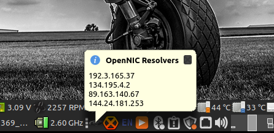

# About The OpenNIC Project

["The OpenNIC Project"](http://www.opennicproject.org) is an organization of dedicated volunteers who run an alternative [DNS](https://en.wikipedia.org/wiki/Domain_Name_System) network. OpenNIC is owned and operated by the OpenNIC community. 

Membership is open to all who share an interest in keeping DNS free for all users. 

The goal of The OpenNIC Project is to provide you with quick and reliable DNS services and access
to domains not administered by [ICANN](https://www.icann.org/).

OpenNIC provides resolution to all ICANN domains as well as OpenNIC's own [TLD](https://en.wikipedia.org/wiki/Top-level_domain)s:

.bbs
.chan
.cyb
.dyn
.geek
.gopher
.indy
.libre
.neo
.null
.o
.oss
.oz
.parody
.pirate


# OpenNIC Wizard Features
  - OpenNIC Wizard service continually seeks DNS resolvers with best response times
  - No-pain approach to setting up your PC to work with The OpenNIC Project
  - OpenNIC Wizard Task tray applet for observing and optionally tweeking the configuration
  - To start using The OpenNIC Project today, use OpenNIC Wizard. 
  - Simply run the installer and you're instantly using OpenNIC resolvers.

# Build

## Dependencies

* Qt5.x

## Linux

```
git clone https://github.com/8bitgeek/OpenNIC-Wizard.git
cd OpenNIC-Wizard
qmake
make
```
## Windows

...mumble mumble...

# Install

## Linux

...mumble mumble...

## Windows

...mumble mumble...

# T1 Bootstrap File

The T1 [(Tier 1)](https://servers.opennic.org/?tier=1) bootstrap file (server/bootstrap.t1) should be kept up to date with the current T1 resolver list

The T1 OpenNIC resolvers are the root domain servers for OpenNIC.

[server/bootstrap.t1](server/bootstrap.t1)

```
161.97.219.84
163.172.168.171
94.103.153.176
207.192.71.13
178.63.116.152
209.141.36.19
188.226.146.136
198.98.51.33
79.124.7.81
144.76.103.143

```

# Bootstrap Domains

The T1 bootstrap test data set.

TLDs to use for testing TDL availability and performance.

[server/bootstrap.domains](server/bootstrap.domains)

```
icann;wikipedia.org
icann;www.abs.gov.au
icann;yahoo.com
icann;google.com
icann;360.cn
icann;canada.ca
icann;8bitgeek.net
icann;opennicproject.org
opennic;grep.geek
opennic;opennic.glue
opennic;reg.for.free
opennic;register.bbs
opennic;register.gopher
opennic;register.ing
```

# Screen Captures

Task Tray Bubble Status



Detailed examination of the quality of resolver pool.


Journal showing resolver pool status monitoring and updating.


Windows 7 From 2012


