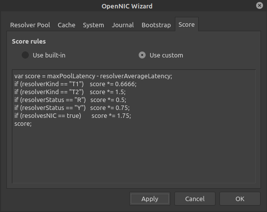
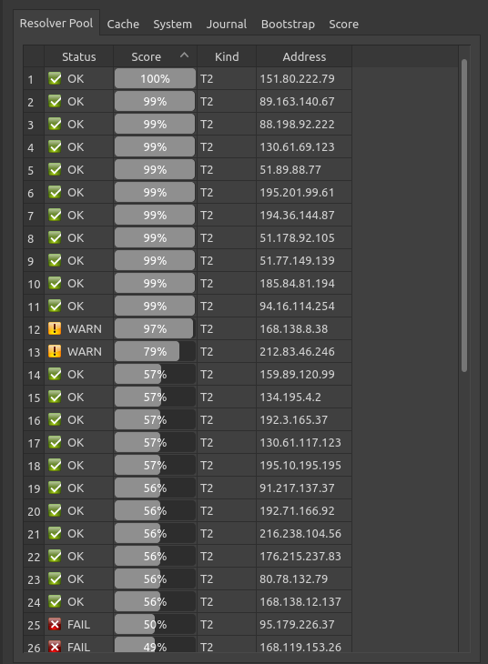

# Latest Microsoft Windows Installer

Download and run the latest [MS Windows 64-bit Installer](https://github.com/8bitgeek/OpenNIC-Wizard/releases/tag/0.6.beta1)


# About The OpenNIC Project

["The OpenNIC Project"](http://www.opennicproject.org) is an organization of dedicated volunteers who run an alternative [DNS](https://en.wikipedia.org/wiki/Domain_Name_System) network. OpenNIC is owned and operated by the OpenNIC community. 

Membership is open to all who share an interest in keeping DNS free for all users. 

The goal of The OpenNIC Project is to provide you with quick and reliable DNS services and access
to domains not administered by [ICANN](https://www.icann.org/).

OpenNIC provides resolution to all ICANN domains as well as OpenNIC's own [TLD](https://en.wikipedia.org/wiki/Top-level_domain)s:

.bbs
.chan
.cyb
.dyn
.geek
.gopher
.indy
.libre
.neo
.null
.o
.oss
.oz
.parody
.pirate

# OpenNIC Wizard Rationale

The OpenNIC DNS pool consists of a diverse collection of servers around the globe. Individual resolvers are largely run by individuals, and may experience some down time on occasion or may go permanently dark without warning.

On the other hand new resolvers may appear which are closer to you.

As you can see, the nature of the OpenNIC resolver pool means that there is a dynamic nature to it. 

Entering DNS resolvers by hand can be a neusance when one of your resolvers go off-line, and on the other hand you may not be aware that a better performing resolver comes online closer to you.

The intent which drives the OpenNIC Wizard project, is provide an means for your PC to continually test the quality of the OpenNIC resolver pool and select only those which are performing the best for you at your current location. The resolver selection process should be completely transparent to the end user.

# OpenNIC Wizard Features
  - OpenNIC Wizard service continually seeks DNS resolvers with best performance.
  - No-pain approach to setting up your PC to work with The OpenNIC Project
  - OpenNIC Wizard Task tray applet for observing and optionally tweeking the configuration
  - To start using The OpenNIC Project today, use OpenNIC Wizard. 
  - Simply run the installer and you're instantly using OpenNIC resolvers.

# Method of Operation Overview

The OpenNIC Wizard is divided into ttwo parts, *opennicd* and *opennicui*.

In this way, the DNS resolver function and the Graphical User Interface (GUI) component are able to operate independently of one another.

## About *opennicd*

The bootstrap.t1 file is a list of IP addresses which *opennicd* uses to locate the T1 (root) resolvers. 

Onces the T1 resolvers have been confirmed, they are quried in such a way as to walk the tree of [T2](https://servers.opennic.org/?tier=2) resolvers and buuild a table of the T2 resolvers.

Once a resolver tree has been constructed, then, periodically a resolver is chosen at random, 
and is tested for performance, given a random TLD from the bootstrap.domains, file, the resolver success, and round-trip time are both captures, and retained as a record of that resolver's performance.

As resolvers are tested this way, the higher performing resolvers float to the top of the list.

Once therre is sufficient change in the top pwerformers, then the resolver pool currrently being used by the operting system is swappedd out for the N number of top performers. Where N defaults to 3, and is user selectable.

The goal is to keep the operating system up to date with the best performing resolvers from your location.

## About *opennicui*

A task-tray applet is provided. It is not required for OpenNIC Wizard to work. It is for Human interraction.

The *opennicd* and OpenNIC applet communicate over local domain sockets. Hence the server/cliant metaphore.

The *opennicd* portion must run with elevated privilages in order to manipulate the operating system DNS resolver pool.

The OpenNIC task tray applet runs with user privilage.


# Build

## Dependencies

* Qt5.x Development

## Linux

```
git clone https://github.com/8bitgeek/OpenNIC-Wizard.git
cd OpenNIC-Wizard
qmake
make
```
## Windows

* Install [Qt5 Development](https://download.qt.io/official_releases/qt/5.12/5.12.12/qt-opensource-windows-x86-5.12.12.exe) w/mingw compiler support.
* Install [cygwin](https://www.cygwin.com/)
* Install [Inno Setup](https://jrsoftware.org/isdl.php)
* Install [Qt5]

...do some stuff...


```
cat win-bash_profile >> ~/.bash_profile
```

...do some stuff...


```
qmake
make
./win-prepare.sh
```

...mumble mumble...

# Installation

## Linux

System Installation into /usr/local/...

```
sudo ./install.sh
```
If you wish to run *opennicd* upon startup...
```
sudo -s
echo /etc/local/bin/opennicd >> /etc/rc.local
exit
```
If you wish to install desktop launcher icon
```
cp client/OpenNIC.desktop ~/Desktop/
```
If you wish to install auto-run launcher
```
cp client/OpenNIC.desktop ~/.config/autostart/
```

## Windows

Download and run the latest Microsoft[Windows 64-bit Installer](https://github.com/8bitgeek/OpenNIC-Wizard/releases/tag/0.6.beta1)

If you're having trouble with OpenNic Wizard on MS Windows(tm), check that the correct network interface is selected:


# T1 Bootstrap File

The T1 (Tier 1) bootstrap file (server/bootstrap.t1) should be kept up to date with the [current T1 resolver list](https://servers.opennic.org/?tier=1)

The T1 OpenNIC resolvers are the root domain servers for OpenNIC.

Although these servers change very infrequently, they do change from time to time. 

[server/bootstrap.t1](server/bootstrap.t1)

```
161.97.219.84
163.172.168.171
94.103.153.176
207.192.71.13
178.63.116.152
209.141.36.19
188.226.146.136
198.98.51.33
79.124.7.81
144.76.103.143

```
## Linux bootstrap.t1 location search order

* OPENNIC_T1_BOOTSTRAP environment variable.
* /usr/local/etc/bootstrap.t1
* /usr/etc/bootstrap.t1
* /etc/bootstrap.t1
* /opt/opennic/bootstrap.t1

# Bootstrap Domains

The T1 bootstrap test data set.

TLDs to use for testing TDL availability and performance.

[server/bootstrap.domains](server/bootstrap.domains)

```
icann;wikipedia.org
icann;www.abs.gov.au
icann;yahoo.com
icann;google.com
icann;360.cn
icann;canada.ca
icann;8bitgeek.net
icann;opennicproject.org
opennic;grep.geek
opennic;opennic.glue
opennic;reg.for.free
opennic;register.bbs
opennic;register.gopher
opennic;register.ing
```
## Linux bootstrap.domains location search order

* OPENNIC_DOMAINS_BOOTSTRAP environment variable.
* /usr/local/etc/bootstrap.domains
* /usr/etc/bootstrap.domains
* /etc/bootstrap.domains
* /opt/opennic/bootstrap.domains

# Screen Captures


Task Tray Bubble Status


Don't like the wizard's resolver scoring rules? Make your own. 



Detailed examination of the quality of resolver pool.




Journal showing resolver pool status monitoring and updating.


Windows 7 From 2012


